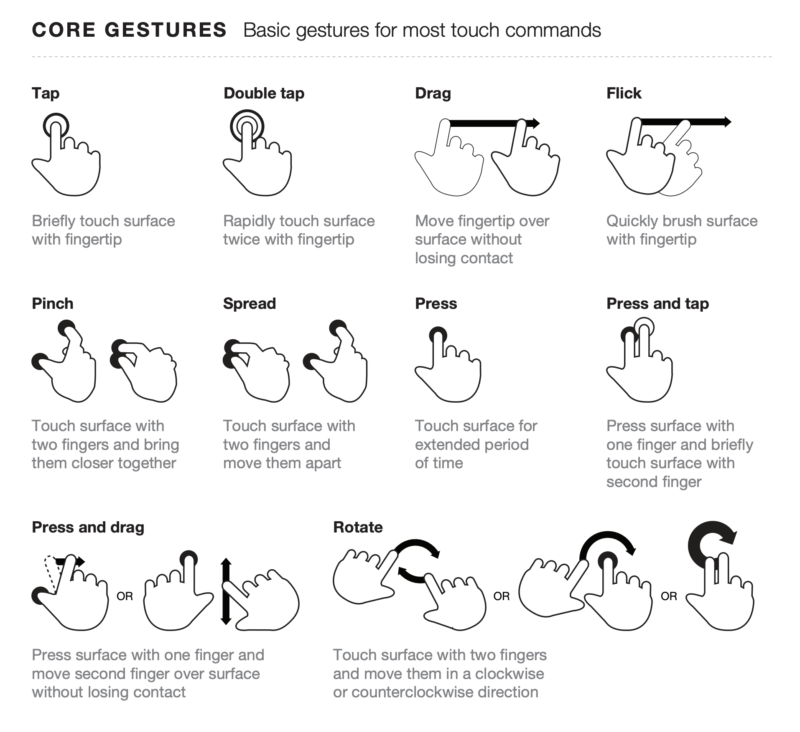

# Concepts

## Multi-touch
Using the default checkers for touch, InputTouch will treat the youngest touch as the default. That is to say that the last touch on the screen will be returned by those getter functions. If you wish to manually contol multi-touch, you can supply an optional parameter of `touchIndex` to get the specific touch index you are looking for.

## Gestures
### What is a gesture?
A gesture is a higher-level interaction that uses actions. InputTouch supports taps, double taps, long taps, flicking, dragging, rotating and zooming gestures.

Image from <a href="https://www.lukew.com/ff/entry.asp?1071">LukeW</a> licesed under CC BY-NC-SA 3.0

Please read the gesture documentation for information for getting various gestures.